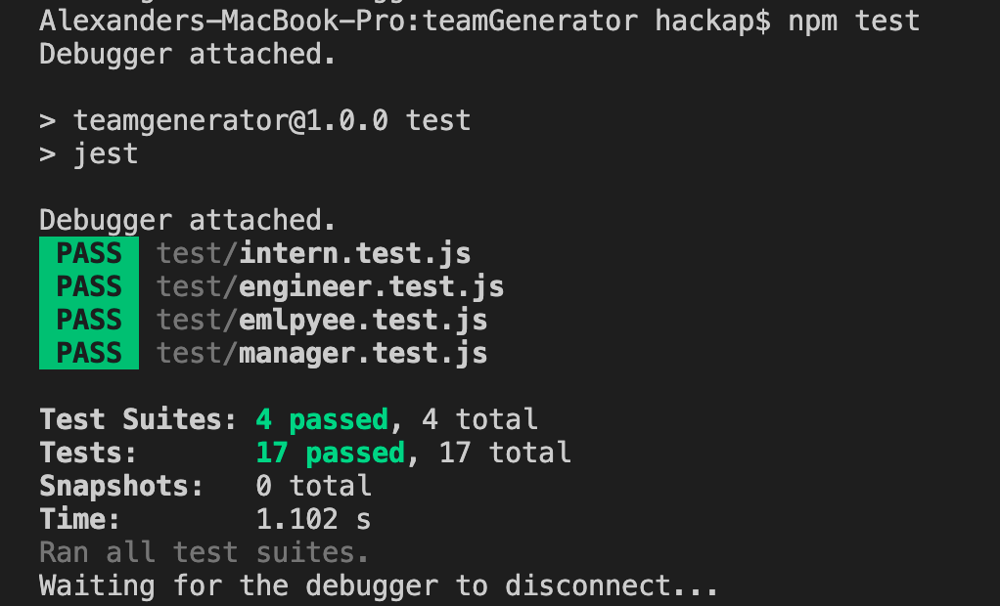
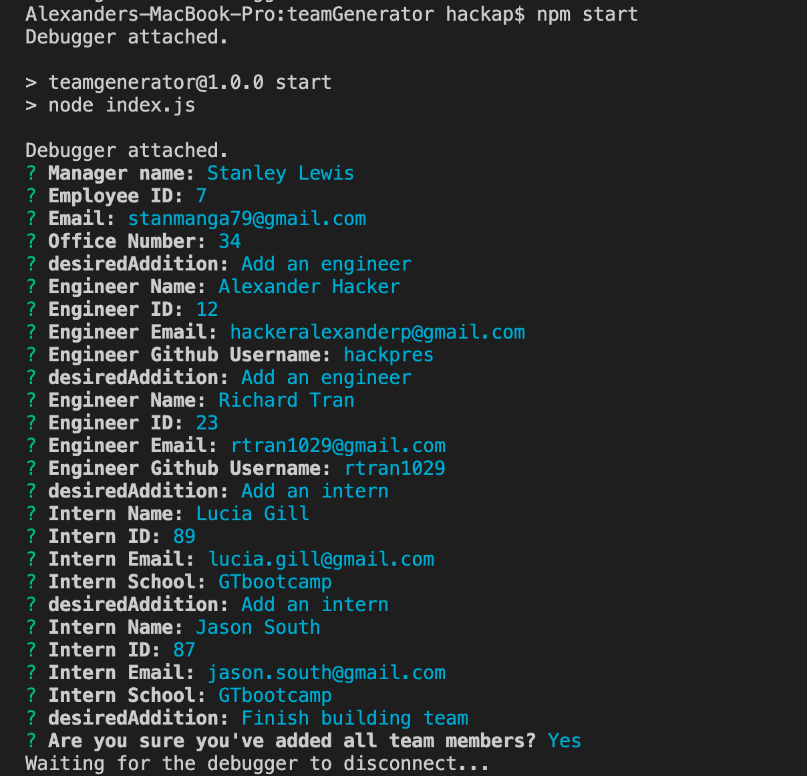
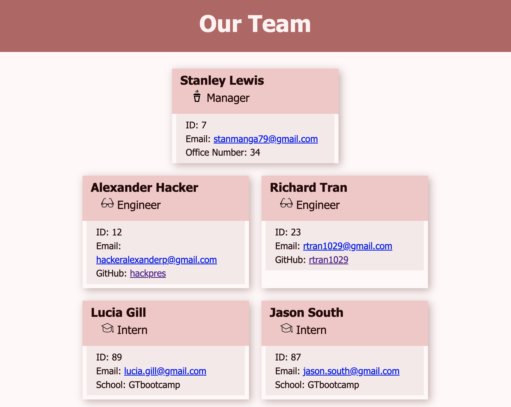

# Team Generator.


## Description
Team Generator is a CLI application designed to run in node.js and used to update and generate an html page to display an organizations employees.

    The real motivation behind Team Generator is to practice building and running tests using jest.

    I learned and utilized many different programming concepts while developing Team Generator. For instance building a parent class, and then extending that class with appropriate subclasses. reinforcing both the use of require() for files, but also maintaining quality file structure as my codebase grew to include more and more files and directories.

<br/>


## Table of Contents

* **[Installation](#installation)**<br />
* **[Usage](#usage)**<br />
* **[License](#license)**<br />
* **[Tests](#tests)**<br />
* **[Contributing](#contributing)**<br />
* **[Contact](#contact)**<br />

### Installation
<a name="installation"/>

```
npm i
```

### Usage
<a name="usage"/>
Initialize Team Generator in your terminal with "npm start" answer the question prompts to build your organizations team!<br/><br/>

<br/>
<br/>


### License
<a name="license"/>

<a href="https://choosealicense.com/licenses/mit/">mit</a><br/>
            For more information on the coverage of this license please click on the link above.

### Tests
<a name="tests"/>

```
npm test
```

### Contributing
<a name="contributing"/>
hackpres is the primary contributor.


### Contact
<a name="contact"/>
for questions please contact <a href="https://github.com/hackpres">hackpres</a><br/>

